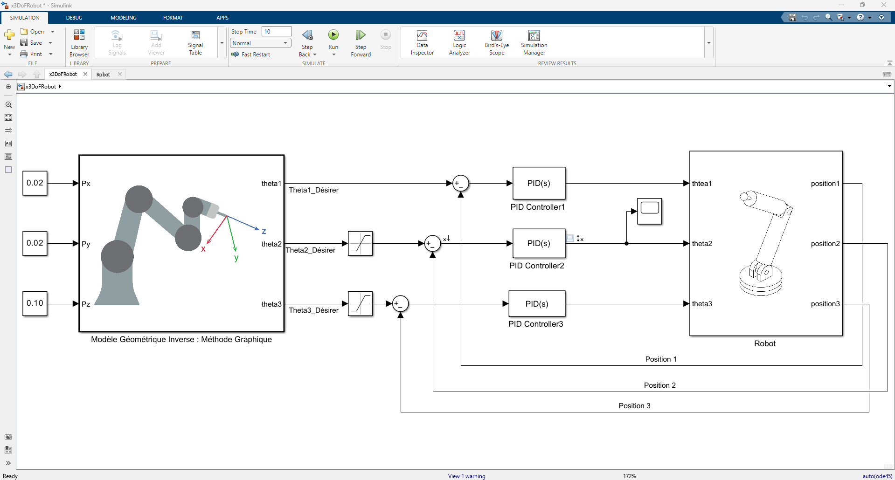

# 3‑DOF Robot Manipulator Control (MATLAB/Simulink + PID + Differential Evolution)

A complete end‑to‑end academic robotics project: **model a 3‑DoF revolute robot (Revolute1..3) in Simscape Multibody**, compute **inverse kinematics** to convert a Cartesian setpoint $(P_x,P_y,P_z)$ into joint targets $(\theta_{1d},\theta_{2d},\theta_{3d})$, and **track the motion with 3 independent joint PID loops**.  
On top of that, the repository includes a **Differential Evolution (DE)** script to **optimize the 9 PID gains** $[K_p,K_i,K_d] \times 3$ using a simulation‑based cost (e.g., **ITAE**).

---

## Table of contents

- [Project at a glance](#project-at-a-glance)
- [Key features](#key-features)
- [Repository structure](#repository-structure)
- [Prerequisites](#prerequisites)
- [Quick start (run the main model)](#quick-start-run-the-main-model)
- [How the Simulink model is built](#how-the-simulink-model-is-built)
- [Kinematics](#kinematics)
  - [Forward kinematics (DH)](#forward-kinematics-dh)
  - [Inverse kinematics](#inverse-kinematics)
  - [Trajectory generation (5th-order polynomial)](#trajectory-generation-5th-order-polynomial)
- [Control](#control)
  - [Joint-space PID control](#joint-space-pid-control)
  - [Performance metric / cost function](#performance-metric--cost-function)
- [Differential Evolution (DE) PID tuning](#differential-evolution-de-pid-tuning)
  - [What is optimized](#what-is-optimized)
  - [How to run the DE script](#how-to-run-the-de-script)
  - [Tips for stable optimization runs](#tips-for-stable-optimization-runs)
- [CAD and 3D assets](#cad-and-3d-assets)
- [Roadmap / ideas](#roadmap--ideas)
- [Acknowledgments](#acknowledgments)

---

## Project at a glance

**Main workflow**
1. Define a Cartesian target (or trajectory) $p_d(t) = [x_d(t)\;y_d(t)\;z_d(t)]^\top$
2. **Inverse Kinematics (IK / MGI)**: compute $\theta_d(t)$
3. **PID per joint**: compute control input for each revolute joint
4. **Simscape Multibody robot**: simulate the 3D motion and measure joint positions
5. Optionally run **DE** to auto‑tune PID gains against a chosen performance metric

**Simulink overview (from the model)**


**Simscape Multibody visualization**


---

## Key features

- **3 revolute joints** (Revolute1..3) simulated in **Simscape Multibody**
- **Inverse kinematics** block converting $(P_x,P_y,P_z)$ → $(\theta_{1d},\theta_{2d},\theta_{3d})$
- **3× PID(s)** blocks for joint tracking with feedback $(\theta_1,\theta_2,\theta_3)$
- **Differential Evolution** optimizer to tune **9 PID parameters** automatically
- Included **report and slides** (PDF/PPT) for the full academic write‑up
- Included **CAD assets** (SolidWorks assembly + exported STEP parts)

---

## Repository structure

```
Projet_Robotique_DE/
├─ x3DoFRobot.slx                 # Main Simulink model (IK + joint PID + Simscape robot)
├─ x3DoFRobot2.slx                # Alternative/extended model variant (more blocks & signals)
├─ x3DoFRobotdynamique.slx        # Variant including additional dynamics/control chain
├─ x3DoFRobot_DataFile.m          # Simscape Multibody data file (generated from CAD import)
│
├─ Script.mlx                     # Live Script: kinematics + trajectories + dynamics derivations
├─ matric_homogene.m              # Helper: homogeneous transform from DH parameters
├─ Optimisation_DE.m              # Differential Evolution (DE) script to tune PID gains
│
├─ Images/                        # Figures used in the report/README
│  ├─ Model.png
│  ├─ Robot 2D.png
│  ├─ Robot 3D Simulink.png
│  ├─ Scoop_PID.png
│  └─ ...
│
├─ Solidworks Model/              # CAD design
│  ├─ 3DoF Robot.SLDASM
│  ├─ Base.SLDPRT
│  ├─ Link1.SLDPRT
│  ├─ Link2.SLDPRT
│  ├─ Link3.SLDPRT
│  └─ EndEffector.SLDPRT
│
├─ PDFs/
│  ├─ Rapport du Projet.pdf       # Full report
│  └─ Papers Used/                # References used during the project
│
└─ PPT/                           # Presentation slides
```

---

## Prerequisites

**Recommended environment**
- MATLAB + Simulink
- **Simscape Multibody** (project data file indicates Multibody 7.x)
- Optional but useful:
  - Symbolic Math Toolbox (if you want to re-run symbolic derivations inside `Script.mlx`)
  - Optimization toolbox is **not required** (DE is implemented manually in `Optimisation_DE.m`)

---

## Quick start (run the main model)

1) **Open MATLAB** and set your current folder to the repo root:
- `Projet_Robotique_DE/`

2) **Load the Multibody data file** (often needed before simulation):
```matlab
run('x3DoFRobot_DataFile2.m');
```

3) **Open the main Simulink model**:
```matlab
open_system('x3DoFRobot.slx');
```

4) Press **Run** in Simulink.

5) Inspect results:
- Use the Scopes (example: `Images/Scoop_PID.png`)  
- Open **Mechanics Explorer** to see the 3D motion

---

## How the Simulink model is built

At a high level, the model is a cascade of 3 subsystems:

### 1) Inverse kinematics block (MGI / “Méthode Graphique”)
- Inputs: `Px`, `Py`, `Pz`
- Outputs: `Theta1_Désirer`, `Theta2_Désirer`, `Theta3_Désirer`

This block converts a Cartesian target into desired joint angles.

### 2) 3 independent PID loops (joint space)
For each joint $i \in \{1,2,3\}$:
- Error: $e_i(t) = \theta_{id}(t) - \theta_i(t)$
- Control: $u_i(t) = K_{pi}e_i(t) + K_{ii}\int e_i(t)\,dt + K_{di}\frac{de_i(t)}{dt}$

### 3) Simscape Multibody robot subsystem
- Contains the rigid bodies + joints (**Revolute1..3**)
- Outputs measured joint positions: `position1`, `position2`, `position3`
- Those outputs feed back to the PID summing junctions

---

## Kinematics

The project includes both **forward** and **inverse** kinematic modeling.

### Forward kinematics (DH)

The helper function `matric_homogene.m` builds a standard homogeneous transform from DH parameters:

```matlab
% X = [a, alpha, d, theta]
M = matric_homogene(X);
```

Internally it matches the classic DH transform:

$$
{}^{i-1}T_i =
\begin{bmatrix}
\cos\theta & -\sin\theta\cos\alpha & \sin\theta\sin\alpha & a\cos\theta \\
\sin\theta & \cos\theta\cos\alpha  & -\cos\theta\sin\alpha & a\sin\theta \\
0          & \sin\alpha            & \cos\alpha            & d \\
0          & 0                     & 0                     & 1
\end{bmatrix}
$$

### Inverse kinematics

There are multiple IK approaches referenced/derived in `Script22.mlx`:
- **Paul method** (matrix manipulation / premultiplication approach)
- **Geometric method** (“Méthode Géométrique / Graphique”)

Example IK identity used (from the live script):
```matlab
theta1_sol_geo = atan2(Py, Px);
```

> The Simulink model uses an IK “MGI / méthode graphique” subsystem to compute $\theta_d$ from $(P_x,P_y,P_z)$.

### Trajectory generation (5th-order polynomial)

The live script also uses a smooth 5th-order time scaling:

$$
s(t)=10\left(\frac{t}{T}\right)^3-15\left(\frac{t}{T}\right)^4+6\left(\frac{t}{T}\right)^5,
\qquad s(0)=0,\; s(T)=1
$$

This lets you interpolate between an initial and final joint target smoothly:
$$
\theta(t) = \theta_0 + s(t)\big(\theta_f - \theta_0\big)
$$

In the script, the progression term appears as:
```matlab
s = 10*(t/T_total)^3 - 15*(t/T_total)^4 + 6*(t/T_total)^5;
```

---

## Control

### Joint-space PID control

The baseline controller is 3 independent PID loops (one per joint). This is simple, robust, and easy to tune.

A typical response curve is shown in:


### Performance metric / cost function

For comparing PID tunings (and for DE optimization), common metrics include:
- ISE, IAE, **ITAE**
- rise time, settling time, overshoot
- effort/energy penalties (e.g., large torques)
- penalties for joint limit violation / saturation

A popular choice for smooth tuning is **ITAE**:

$$
J=\sum_{i=1}^{3}\int_{0}^{T} t\,\lvert e_i(t)\rvert\,dt
$$

---

## Differential Evolution (DE) PID tuning

### What is optimized

`Optimisation_DE.m` optimizes **9 variables**:

$$
[K_{p1},K_{i1},K_{d1},\;K_{p2},K_{i2},K_{d2},\;K_{p3},K_{i3},K_{d3}]
$$

with box constraints (editable in the script), e.g.:
- $K_p \in [0,100]$
- $K_i \in [0,50]$
- $K_d \in [0,10]$

### How to run the DE script

1) Open `Optimisation_DE.m`
2) **Set the model name** inside `evaluate_pid`:
```matlab
simOut = sim('x3DoFRobot', 'SimulationMode', 'normal');
```
3) Make sure your Simulink model exports a scalar **Performance** signal to the workspace, e.g. using a **To Workspace** block named `Performance`.

Then run:
```matlab
run('Optimisation_DE.m');
```

Expected outcome:
- Best gains found after `MaxGen` generations
- A lower cost indicates better tracking (depending on your metric definition)

### Tips for stable optimization runs

- Use a fixed random seed for reproducibility:
  ```matlab
  rng(0);
  ```
- Keep the simulation horizon modest (e.g., 5–10 s) while tuning
- Normalize or weight errors per joint if their ranges differ a lot
- Add penalties to the cost if:
  - torques saturate
  - joint limits are exceeded
  - the solver fails (to avoid “cheating” solutions)

---

## CAD and 3D assets

This repo includes:
- SolidWorks assembly: `Solidworks Model/3DoF Robot.SLDASM`
- Parts: base + links + end effector
- Exported STEP parts at repo root (useful if you don’t have SolidWorks)
- A Simscape Multibody data file `x3DoFRobot_DataFile2.m` (generated after CAD import)

A 2D dimension sketch is included:


---

## Roadmap / ideas

If you want to push this project further:
- Replace independent joint PID with:
  - computed‑torque / feedback linearization
  - backstepping
  - adaptive / robust control (e.g., sliding mode)
- Add a Cartesian trajectory generator (circle/line) and test workspace reachability
- Compare “manual PID tuning” vs “DE tuning” on the same metrics
- Export code to embedded target (Simulink Coder) for real hardware

---

## Credits / Attribution

- **Simscape Multibody robot model source:** This project reused/adapted the Simscape Multibody robot model originally published in the repository `SabirHusnain/3DOF-Robot-Control`. Full credit to the author for the Multibody model foundation.
  - Reference: https://github.com/SabirHusnain/3DOF-Robot-Control

## Acknowledgments

- University course context and full derivations are available in `PDFs/Rapport du Projet.pdf`
- Thanks to the instructor/supervisor listed in the report and the MATLAB/Simulink ecosystem.
